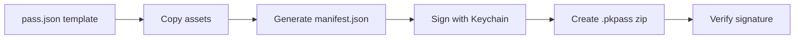

# Exchange Reserve - Phase 1 Implementation Summary

**Date**: October 30, 2025
**Status**: ✅ Phase 1 Complete
**Repository**: https://github.com/dwferrell/exchange-reserve.git

---

## What We Built

### 1️⃣ Hello World Pass ✅

**Purpose**: Baseline validation of PassKit integration

**Features**:
- Minimal event ticket pass
- LocalFund branding (icon, logo, background)
- Valid certificate chain and signature
- QR code verification link
- Serial Number: `HELLO-WORLD-001`

**Status**: ✅ Working - Successfully builds and opens on macOS

**File**: [apps/passkit-apple/dist/hello-world.pkpass](apps/passkit-apple/dist/hello-world.pkpass)

---

### 2️⃣ Event Poster Pass ✅

**Purpose**: Rich layout with geofencing, notifications, and web service integration

**Event Details**:
- **Event**: Impact Briefing — Capitol Fund Quarterly Update
- **Venue**: Bell Tower Hall, Frederick, MD
- **Date**: November 15, 2025 @ 6:00 PM EST
- **Holder Status**: Early Adopter ⓢ2025Q4
- **Serial Number**: `LIFT-2025-AB12`

**Advanced Features**:

#### Geofencing 📍
```json
"locations": [{
  "latitude": 39.4143,
  "longitude": -77.4105,
  "relevantText": "Welcome to Bell Tower Hall! Your Impact Briefing starts soon.",
  "distance": 100
}]
```
- Triggers notification when user is within 100 meters
- Bell Tower Hall coordinates

#### Time-based Notifications ⏰
```json
"relevantDate": "2025-11-15T17:00:00-05:00"
```
- Shows on iPhone lock screen 1 hour before event
- iOS automatically manages notification timing

#### PassKit Web Service 🔄
```json
"webServiceURL": "https://exchangereserve.org/api/passes",
"authenticationToken": "vxwxd7J8AlNNFPS8k0a0FfUFtq0ewzFdc"
```
- Ready for real-time pass updates
- Push notifications via APNs
- Device registration/unregistration

#### Semantics (Siri & Maps) 🗺️
```json
"semantics": {
  "eventType": "PKEventTypeGeneric",
  "eventName": "Capitol Fund Quarterly Update",
  "venueName": "Bell Tower Hall",
  "venueLocation": { "latitude": 39.4143, "longitude": -77.4105 },
  "eventStartDate": "2025-11-15T18:00:00-05:00"
}
```
- "Add to Calendar" suggestions
- Apple Maps directions
- Siri reminders

#### Rich Layout 🎨
- **Primary Field**: Event name
- **Secondary Fields**: Holder status, Venue
- **Auxiliary Fields**: Date/Time, City
- **Back Fields**: About event, Venue details, Certificate info, Contact, Verification

**Status**: ✅ Working - Successfully builds and opens on macOS

**File**: [apps/passkit-apple/dist/event-poster.pkpass](apps/passkit-apple/dist/event-poster.pkpass)

---

## Technical Implementation

### Monorepo Structure
```
exchange-reserve/
├── apps/
│   └── passkit-apple/          # Apple Wallet pass generation
│       ├── assets/             # Icons, logos, backgrounds (@1x/@2x/@3x)
│       ├── certificates/       # Pass Type ID cert, WWDR, signing keys
│       ├── scripts/            # Build, sign, verify scripts
│       ├── templates/          # Pass JSON templates
│       │   ├── hello-world/
│       │   └── event-poster/
│       ├── dist/               # Generated .pkpass files
│       └── package.json
├── packages/                   # (Future: shared-types, ui, pass-core)
├── supabase/                   # (Future: migrations, edge functions)
├── package.json                # Root workspace config
└── pnpm-workspace.yaml         # pnpm workspaces
```

### Pass Generation Pipeline



**Scripts**:
1. **[build-pass.js](apps/passkit-apple/scripts/build-pass.js)**: Main build pipeline
   - Reads template from `templates/{name}/pass.json`
   - Copies all assets (icons, logos, backgrounds)
   - Generates SHA1 manifest
   - Signs manifest using macOS Keychain (`security cms`)
   - Creates .pkpass (zip archive)

2. **[verify-pass.js](apps/passkit-apple/scripts/verify-pass.js)**: Validation tool
   - Extracts and inspects .pkpass
   - Verifies manifest hashes
   - Validates signature (optional)
   - Checks for common issues

3. **[sign-with-keychain.sh](apps/passkit-apple/scripts/sign-with-keychain.sh)**: Shell signing script
   - Alternative bash-based signing
   - Uses `security cms` command

### Certificate Chain

```
Apple Root CA
  └── Apple Worldwide Developer Relations G4
       └── Pass Type ID: pass.exchangereserve.lift
            └── (Your passes)
```

**Details**:
- **Organization**: Localight Inc.
- **Team ID**: `5A984FTAG3`
- **Pass Type Identifier**: `pass.exchangereserve.lift`
- **Certificate Expiry**: November 29, 2026
- **Signing Method**: macOS Keychain via `security cms -S`

**Files**:
- `pass.cer`: Pass Type ID certificate (DER format)
- `signerCert.pem`: Converted to PEM format
- `apple_wwdr_g3.pem`: Apple WWDR G3 intermediate cert
- `Certificates.p12`: Original PKCS12 bundle (password protected)

### Security Measures

✅ **Gitignored**:
- All certificates (`.p12`, `.pem`, `.cer`)
- Environment variables (`.env.local`)
- Generated passes (`.pkpass`)
- Manifest and signature files

✅ **Best Practices**:
- Certificates stored in macOS Keychain
- Signing via `security` command (no exposed private keys)
- Authentication tokens should be unique per pass
- Web service tokens stored server-side

---

## Testing the Passes

### On macOS
```bash
# Build passes
cd apps/passkit-apple
pnpm build:hello    # Hello World pass
pnpm build:event    # Event Poster pass

# Open in Wallet preview
open dist/hello-world.pkpass
open dist/event-poster.pkpass

# Verify pass integrity
node scripts/verify-pass.js dist/event-poster.pkpass
```

### On iPhone

**Method 1: AirDrop (Recommended)** 🚀
1. Open Finder, navigate to `apps/passkit-apple/dist/`
2. Right-click `event-poster.pkpass`
3. Select "Share" → "AirDrop"
4. Choose your iPhone
5. Tap "Add" in Wallet app

**Method 2: Email** 📧
1. Email the `.pkpass` file to yourself
2. Open on iPhone
3. Tap attachment → "Add" to Wallet

**Testing Geofencing** 📍
- Walk to Bell Tower Hall (39.4143, -77.4105)
- iOS will show notification within 100 meters
- Notification text: "Welcome to Bell Tower Hall! Your Impact Briefing starts soon."

**Testing Time Notifications** ⏰
- On November 15, 2025 at 5:00 PM EST (1 hour before event)
- Pass will appear on lock screen
- Siri may remind you about the event

---

## PassKit Web Service Integration (Phase 2)

The Event Poster pass is configured to communicate with a web service. You need to implement these endpoints:

### Required Endpoints

#### 1. Register Device
**POST** `/v1/devices/:deviceID/registrations/:passTypeID/:serialNumber`

Called when user adds pass to Wallet.

**Request Headers**:
- `Authorization: ApplePass {authenticationToken}`

**Request Body**:
```json
{
  "pushToken": "APA91bE...",
  "deviceID": "d3b1..."
}
```

**Response**: `201 Created` or `200 OK` if already registered

---

#### 2. Get Passes for Device
**GET** `/v1/devices/:deviceID/registrations/:passTypeID?passesUpdatedSince=:tag`

Returns list of serial numbers for passes that need updating.

**Request Headers**:
- `Authorization: ApplePass {authenticationToken}`

**Response**:
```json
{
  "lastUpdated": "1635724800",
  "serialNumbers": ["LIFT-2025-AB12", "LIFT-2025-CD34"]
}
```

---

#### 3. Get Latest Version of Pass
**GET** `/v1/passes/:passTypeID/:serialNumber`

Returns updated pass if available.

**Request Headers**:
- `Authorization: ApplePass {authenticationToken}`
- `If-Modified-Since: Wed, 15 Nov 2025 12:00:00 GMT` (optional)

**Response**:
- `200 OK` + `.pkpass` file (if updated)
- `304 Not Modified` (if no changes)

---

#### 4. Unregister Device
**DELETE** `/v1/devices/:deviceID/registrations/:passTypeID/:serialNumber`

Called when user removes pass from Wallet.

**Request Headers**:
- `Authorization: ApplePass {authenticationToken}`

**Response**: `200 OK`

---

#### 5. Log Errors
**POST** `/v1/log`

Receives error logs from iOS devices.

**Request Body**:
```json
{
  "logs": ["Error message 1", "Error message 2"]
}
```

**Response**: `200 OK`

---

### Push Notifications (APNs)

To trigger pass updates on device:

1. **Setup APNs**:
   - Create APNs certificate in Apple Developer portal
   - Configure with PassKit entitlement
   - Store APNs key securely

2. **Send Push Notification**:
```bash
curl -X POST "https://api.push.apple.com/3/device/{pushToken}" \
  -H "apns-topic: pass.exchangereserve.lift" \
  -H "apns-priority: 10" \
  --cert-type P12 --cert apns.p12 \
  -d '{}'
```

3. **Device Behavior**:
   - Device receives silent push
   - Wallet app calls your `/v1/passes/` endpoint
   - If pass changed, downloads new `.pkpass`
   - Updates pass in Wallet automatically

---

## Asset Specifications

### Icon
- **Size**: 29×29 pt (@1x), 58×58 pt (@2x), 87×87 pt (@3x)
- **Format**: PNG with transparency
- **Usage**: Pass thumbnail, notification icon
- **Current**: LocalFund circular logo

### Logo
- **Size**: 160×50 pt (@1x), 320×100 pt (@2x), 480×150 pt (@3x)
- **Format**: PNG with transparency
- **Usage**: Top of pass (below time/location)
- **Current**: LocalFund wordmark

### Background (Event Poster only)
- **Size**: 180×220 pt (@1x), 360×440 pt (@2x), 1080×1320 pt (@3x)
- **Format**: PNG or JPEG
- **Usage**: Full-bleed background behind event details
- **Current**: Abstract blue gradient with LIFT branding

**Note**: All assets must be in sRGB color space.

---

## Next Steps

### Phase 2: PassKit Web Service API 🚧
- [ ] Setup API backend (Node.js/Express or Next.js API routes)
- [ ] Implement 5 required endpoints
- [ ] Database for device registrations
- [ ] APNs integration for push notifications
- [ ] Pass update logic

### Phase 3: Web Application 🚧
- [ ] Next.js 14 app in `apps/web/`
- [ ] Homepage (ExchangeReserve.org)
- [ ] Pass distribution page
- [ ] QR verification endpoint (`/verify/:serialNumber`)
- [ ] User dashboard

### Phase 4: Backend & Supabase 🚧
- [ ] Supabase project setup
- [ ] Database schema (passes, users, registrations)
- [ ] Authentication (Supabase Auth)
- [ ] Edge Functions for pass generation
- [ ] Row-Level Security policies

### Phase 5: Google Wallet 🚧
- [ ] `apps/passkit-google/` project
- [ ] Google Pay API integration
- [ ] JWT signing for Google Wallet
- [ ] Mirror Apple pass structure

### Phase 6: CI/CD & Deployment 🚧
- [ ] Netlify configuration
- [ ] GitHub Actions workflow
- [ ] Automated testing
- [ ] Staging environment

---

## Useful Commands

```bash
# Install dependencies
pnpm install

# Build passes
pnpm build:passes
pnpm build:hello
pnpm build:event

# Verify passes
cd apps/passkit-apple
node scripts/verify-pass.js dist/event-poster.pkpass

# Open pass
open dist/event-poster.pkpass

# Check certificates
security find-identity -v -p codesigning
openssl x509 -in certificates/signerCert.pem -noout -subject -dates

# Clean build artifacts
pnpm clean
rm -rf apps/passkit-apple/dist/temp
```

---

## Troubleshooting

### Pass doesn't open on iPhone
- ✅ Certificate is valid (expires Nov 2026)
- ✅ Team ID matches (5A984FTAG3)
- ✅ Signature is present (2148 bytes)
- ⚠️ Ensure iPhone has iOS 15+ (for semantics features)

### Geofencing not working
- Location Services must be enabled for Wallet
- Test on physical device (not simulator)
- Walk within 100 meters of venue
- Check notification settings

### Signature verification fails
- Certificate chain may need intermediate cert
- Use `security cms -D -i signature` to inspect signature
- Verify with: `openssl smime -verify -in signature -inform DER -content manifest.json`

---

## Resources

- **Apple PassKit Documentation**: https://developer.apple.com/documentation/passkit
- **PassKit Package Format**: https://developer.apple.com/documentation/passkit/wallet/creating_the_source_for_a_pass
- **PassKit Web Service**: https://developer.apple.com/documentation/passkit/wallet/implementing_wallet_with_a_server
- **Pass Design Guidelines**: https://developer.apple.com/library/archive/documentation/UserExperience/Conceptual/PassKit_PG/

---

## Development Team

- **Organization**: Localight Inc.
- **Project**: Exchange Reserve PBLLC
- **Service**: LocalFund
- **Website**: https://exchangereserve.org
- **Contact**: hello@exchangereserve.org

---

## License

UNLICENSED - Proprietary

---

**Generated**: October 30, 2025
**Last Updated**: October 30, 2025
**Version**: 0.1.0 (Phase 1 Complete)
